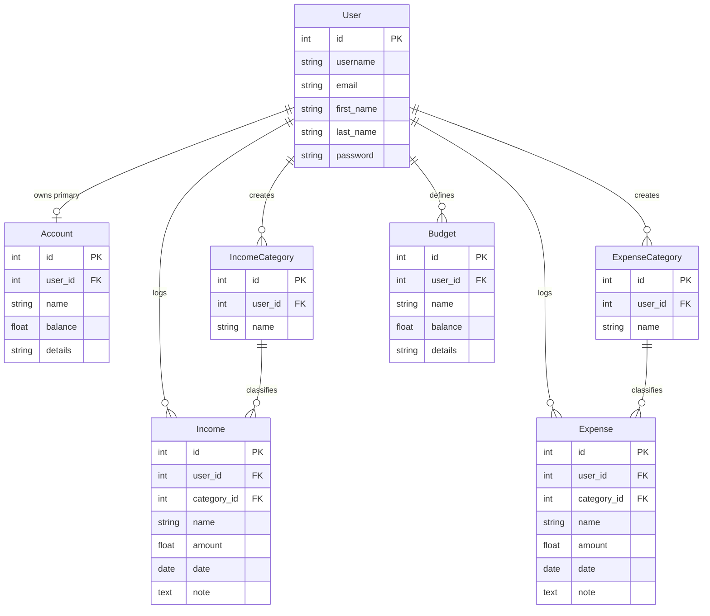
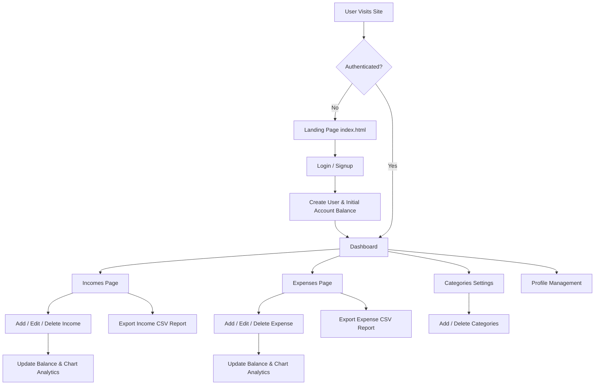

# 💰 Finance Tracker — Personal FinTech Web Application


> A full-stack, data-driven personal financial management platform built with **Django**, **SQLite**, and **Chart.js**. **Finance Tracker** empowers users to log earnings and expenditures, build user-customized categories, view real-time account balances, analyze financial health through interactive multi-chart dashboards, and export time-bound CSV financial reports.

---

## 📋 Table of Contents

- [✨ Core & Key Features](#-core--key-features)
- [🛠️ Tech Stack & Technologies Used](#️-tech-stack--technologies-used)
- [🏗️ System Architecture & Database Design](#️-system-architecture--database-design)
- [📁 Project Directory Structure](#-project-directory-structure)
- [🌐 Application Workflow & User Experience](#-application-workflow--user-experience)
- [🛣️ URL Routing & Endpoints](#️-url-routing--endpoints)
- [📊 Analytics & Export Capabilities](#-analytics--export-capabilities)
- [🚀 Installation & Setup Guide](#-installation--setup-guide)
- [⚙️ Configuration & Production Deployment](#️-configuration--production-deployment)
- [🔐 Admin Management](#-admin-management)
- [🤝 Contributing](#-contributing)
- [📄 License](#-license)

---

## ✨ Core & Key Features

### 📊 1. Interactive Visual Dashboard
* **Real-time Account Balance**: Instant updates reflecting net financial standing calculated dynamically from income entries and expense deductions.
* **10-Day Income Trend Analysis**: Bar chart powered by Chart.js displaying earnings over the past 10 days.
* **10-Day Expense Trend Analysis**: Line chart illustrating spending patterns across the last 10 days.
* **Expense Breakdown by Category**: Color-coded Doughnut chart giving a visual representation of expenditure allocation.

### 💵 2. Comprehensive Income Management
* Log new income sources with **Title/Name**, **Custom Category**, **Amount**, **Transaction Date**, and **Notes**.
* Automated real-time addition to total primary account balance (`balance += amount`).
* Inline action handlers to **Edit** transaction details (with automatic differential balance recalculation) or **Delete** income records.

### 💸 3. Smart Expense Tracking
* Record daily expenses categorized precisely (e.g., Food, Housing, Utilities, Subscriptions).
* Automated real-time deduction from primary account balance (`balance -= amount`).
* Full **CRUD capabilities** with built-in protection and atomic database updates.

### 🏷️ 4. Custom Category System
* Multi-tenant data model allowing users to define unique **Income Categories** and **Expense Categories**.
* Dynamic management interface to add or remove categories on the fly.

### 📁 5. Financial Data Export & Reports
* Instant CSV report generation with dedicated duration parameters:
  * 📅 **Daily Report** (Past 24 Hours)
  * 🗓️ **Weekly Report** (Past 7 Days)
  * 📆 **Monthly Report** (Past 30 Days)
  * 📜 **All-Time Report** (Complete Historical Ledger)
* Downloads standard formatted `.csv` files suitable for Excel, Google Sheets, or tax processing.

### 🔐 6. User Authentication & Multi-Tenancy
* Secure registration (Signup) and authentication (Login/Logout) built on Django's authentication system.
* Account isolation ensures each user accesses only their own categories, ledgers, balances, and reports.
* Profile settings page allowing users to update personal credentials (First Name, Last Name, Email).

---

## 🛠️ Tech Stack & Technologies Used

### Backend Framework & Logic
| Technology | Description |
| :--- | :--- |
| **[Python 3.x](https://www.python.org/)** | Primary programming language for backend server logic and calculations. |
| **[Django 4.2.5](https://www.djangoproject.com/)** | High-level Python Web Framework following the MVT (Model-View-Template) pattern. |
| **[Django ORM](https://docs.djangoproject.com/en/4.2/topics/db/models/)** | Object-Relational Mapper used for querying, aggregations (`Sum`), atomic operations (`F()`), and model relationships. |
| **[Python `csv` Module](https://docs.python.org/3/library/csv.html)** | Standard library module used to assemble and stream dynamic CSV file attachments in response objects. |

### Database
| Technology | Description |
| :--- | :--- |
| **[SQLite3](https://www.sqlite.org/)** | Lightweight, zero-configuration relational database engine used for local development and persistence. |

### Frontend & Data Visualization
| Technology | Description |
| :--- | :--- |
| **[HTML5](https://developer.mozilla.org/en-US/docs/Web/HTML)** | Semantic HTML structure for all layout templates. |
| **[CSS3](https://developer.mozilla.org/en-US/docs/Web/CSS)** | Custom stylesheet design architecture featuring flex/grid layouts, response views, dark gradients, and UI elements. |
| **[JavaScript (ES6)](https://developer.mozilla.org/en-US/docs/Web/JavaScript)** | Client-side DOM manipulation, modal popups, dynamic form visibility, and chart rendering. |
| **[Chart.js 3.7.0](https://www.chartjs.org/)** | JavaScript charting library utilized to render responsive HTML5 canvas bar, line, and doughnut charts. |

---

## 🏗️ System Architecture & Database Design

### Data Models & Relationships



---

## 📁 Project Directory Structure

```plain
finance_tracker/
├── FinanceTracker/           # Root Django Configuration App
│   ├── __init__.py
│   ├── asgi.py               # Asynchronous Server Gateway Interface entry point
│   ├── settings.py           # Main settings (Installed apps, Middleware, Database, Static/Media)
│   ├── urls.py               # Global URL dispatcher routing to FinTech app
│   └── wsgi.py               # Web Server Gateway Interface entry point
│
├── FinTech/                  # Core Application Module
│   ├── migrations/           # Database schema migrations
│   ├── admin.py              # Custom Django Admin panel views & search filters
│   ├── apps.py               # App configuration
│   ├── models.py             # Database models (Account, Income, Expense, Categories, Budget)
│   ├── tests.py              # Unit tests placeholder
│   ├── urls.py               # Application-level route declarations
│   └── views.py              # Controller logic, aggregations, auth flows & CSV report exporters
│
├── static/                   # Static Frontend Assets
│   ├── css/                  # Custom CSS stylesheets
│   │   ├── dashboard.css
│   │   ├── expense.css
│   │   ├── income.css
│   │   ├── nav.css
│   │   ├── profile.css
│   │   ├── setting.css
│   │   └── styles.css
│   ├── js/                   # Client-side script execution
│   │   ├── dashboard.js
│   │   ├── script.js
│   │   └── setting.js
│   └── img/                  # UI background & iconography assets
│
├── templates/                # HTML Templates (Django Template Engine)
│   ├── dashboard.html        # Main dashboard with Chart.js canvas elements & balance card
│   ├── expense.html          # Expense transaction list, creation modal, report controls
│   ├── expense_edit.html     # Expense modification form
│   ├── income.html           # Income transaction list, creation modal, report controls
│   ├── income_edit.html      # Income modification form
│   ├── index.html            # Landing / Auth page (Login & Signup modal views)
│   ├── profile.html          # User profile detail & editing view
│   └── settings.html         # Custom Income & Expense category manager
│
├── assets/                   # Collected static directory for deployment
├── db.sqlite3                # SQLite database storage file
├── manage.py                 # Django CLI management script
├── requirements.txt          # Python project dependencies
└── README.md                 # Project Documentation
```

---

## 🌐 Application Workflow & User Experience



---

## 🛣️ URL Routing & Endpoints

| URL Pattern | View Function | HTTP Method | Description |
| :--- | :--- | :---: | :--- |
| `/` | `views.index` | `GET` | Landing page or redirects to `/dashboard` if logged in |
| `/signup` | `views.signup` | `POST` | Registers user & initializes primary financial `Account` |
| `/login` | `views.login` | `POST` | Authenticates user credentials and starts session |
| `/logout` | `views.logout` | `GET` | Terminates user session and redirects to landing |
| `/dashboard` | `views.dashboard` | `GET` | Financial analytics dashboard with Chart.js visualizations |
| `/incomes` | `views.income` | `GET / POST` | View income history or record new income |
| `/expenses` | `views.expenses` | `GET / POST` | View expense history or record new expense |
| `/edit-income/<id>` | `views.edit_income` | `GET / POST` | Edit an existing income entry |
| `/edit-expense/<id>` | `views.edit_expense` | `GET / POST` | Edit an existing expense entry |
| `/delete-income/<id>` | `views.delete_income` | `GET` | Delete income & recalculate account balance |
| `/delete-expense/<id>` | `views.delete_expense` | `GET` | Delete expense & restore account balance |
| `/income-report/<duration>` | `views.income_report` | `GET` | Stream CSV report (`daily`, `weekly`, `monthly`, `alltime`) |
| `/expense-report/<duration>` | `views.expense_report` | `GET` | Stream CSV report (`daily`, `weekly`, `monthly`, `alltime`) |
| `/settings` | `views.settings` | `GET / POST` | Category management panel & profile update |
| `/add-income-category` | `views.add_income_category` | `POST` | Add new income category |
| `/add-expense-category` | `views.add_expense_category` | `POST` | Add new expense category |
| `/remove-income-category/<id>` | `views.remove_income_category` | `GET` | Remove income category |
| `/remove-expense-category/<id>` | `views.remove_expense_category` | `GET` | Remove expense category |
| `/profile` | `views.profile` | `GET / POST` | View and edit user profile attributes |

---

## 📊 Analytics & Export Capabilities

### Data Aggregations
* **Last 10 Days Income/Expense Querying**:
  Utilizes Django's `date__gte` and `date__lt` filters combined with `Sum('amount')` aggregation to extract a 10-day rolling snapshot.
* **Category Total Share**:
  Aggregates total spending mapped to each distinct `ExpenseCategory` owned by the logged-in user to compute pie/doughnut segment values dynamically.

### CSV Export Mechanism
Export reports stream dynamically generated `.csv` files using Python's standard `csv.writer` attached directly to Django's `HttpResponse(content_type='text/csv')`:
```python
response = HttpResponse(content_type='text/csv')
response['Content-Disposition'] = f'attachment; filename="Expenses_{duration}_report.csv"'
writer = csv.writer(response)
writer.writerow(["Sr.No.", "Name", "Category", "Amount", "Date", "Note"])
```

---

## 🚀 Installation & Setup Guide

### Prerequisites
* **Python 3.8+** installed on your system.
* **Git** for cloning the repository.
* **pip** (Python package installer).

---

### Step 1: Clone the Repository
```bash
git clone https://github.com/amulya195/finance_tracker.git
cd finance_tracker
```

---

### Step 2: Set Up a Virtual Environment

#### On Windows (PowerShell / Command Prompt):
```powershell
python -m venv env
.\env\Scripts\activate
```
> *Note for Windows execution policy issue*: If activation fails, run:
> ```powershell
> Set-ExecutionPolicy Unrestricted -Scope Process
> ```

#### On macOS / Linux:
```bash
python3 -m venv env
source env/bin/activate
```

---

### Step 3: Install Dependencies
```bash
pip install -r requirements.txt
```

If `requirements.txt` is missing specific versions, you can install Django directly:
```bash
pip install Django==4.2.5
```

---

### Step 4: Apply Database Migrations
Initialize the SQLite database schema:
```bash
python manage.py makemigrations
python manage.py migrate
```

---

### Step 5: Create Administrative Superuser (Optional)
To access the Django Admin interface:
```bash
python manage.py createsuperuser
```
Follow the prompts to enter a username, email, and password.

---

### Step 6: Start Development Server
```bash
python manage.py runserver
```

Open your browser and navigate to:
* **Web App**: `http://127.0.0.1:8000/`
* **Admin Portal**: `http://127.0.0.1:8000/admin/`

---

## 🔐 Admin Management

The Django Admin site is pre-configured with custom list views, search filters, and display fields for all core models:
* **IncomeAdmin**: Filter by user, category, and date. Search by income name.
* **ExpenseAdmin**: Filter by user, category, and date. Search by expense name.
* **AccountAdmin**: Display user assignment and current balance balance.

---

## ⚙️ Configuration & Production Deployment

For production deployments (e.g., AWS, Heroku, DigitalOcean, Vercel, PythonAnywhere):

1. **Security**: Set `DEBUG = False` in `FinanceTracker/settings.py` and assign a unique environment variable for `SECRET_KEY`.
2. **Allowed Hosts**: Update `ALLOWED_HOSTS = ['yourdomain.com']`.
3. **Static Files**: Collect static assets for production serving using:
   ```bash
   python manage.py collectstatic
   ```
4. **Database Migration**: For production scale, configure PostgreSQL or MySQL by modifying `DATABASES` dictionary in `settings.py`.

---

## 🤝 Contributing

Contributions are welcome! If you'd like to improve Finance Tracker, please follow these steps:

1. **Fork the Repository**
2. **Create a Feature Branch** (`git checkout -b feature/AmazingFeature`)
3. **Commit Your Changes** (`git commit -m 'Add some AmazingFeature'`)
4. **Push to the Branch** (`git push origin feature/AmazingFeature`)
5. **Open a Pull Request**

---

## 📄 License

Distributed under the **MIT License**. See `LICENSE` for more information.

---

<p center="text-align">
Made with ❤️ by <a href="https://github.com/amulya195">Amulya, Akanksh, Akshaya and Akarsh</a>
</p>
